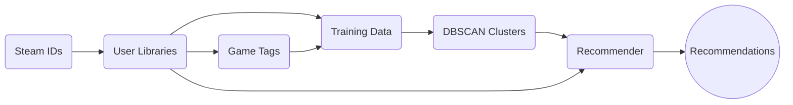

# Steam Library Recommender

## Introduction
SteamLibRec is a tool that utilizes a DBSCAN clustering algorithm machine learning model to create archetypes of "gamers" that exist on the game platform Steam. The model creates distinct types of game libraries based on hundreds of users' libraries and runs a similarity calculation against a new single library in order to determine which categories a Steam user may fall. Once prominent similarity scores for pre-defined groupings are established, some un-owned games from those with similar libraries are recommended!

## Data

The library data is gathered first by extracting a mass amount of IDs from any public Steam group utilizing the **getgroupids** script. Then these Steam IDs are piped into the **getlibraries** script. Each users top ten games and their playtimes are saved, as well as an aggregate of all the games across all libraries, and their unique Steam game identifiers. Next the public defined categories are extracted for each game through the **gettags** script.

## Creating the Training Data

With the users' libraries and all games with their filtered and prominent game tags are collected, the training data is created through the **createinputdata** script. Users libraries are taken apart and rearranged to a distillation of only the tags associated with their top games, and their playtimes distributed amongst these tags. Then the data undergoes normalization via max scale normalization. The finalized processed data is saved as a dataframe for further use.

## DBSCAN Clustering

Model creation and ouput for the models is performed within the **createclusters** script. DBCAN operates given a minimum sample amount, and the epsilon value. To determine optimal values, a k nearest neighbors analysis utilizing the Python Kneed library to assist with automatic ascertation is performed. A plot is saved for manual review and decision for the eps value. Once optimal values are set the DBSCAN model performs unsupervised clustering finding unique geometries and creates groupings. After this, some further processing of the groupings is performed, combining unique clusters that share over 50% similarity. The labelled DBSCAN clusters are re-mapped to these merged cluster labels and saved for similarity scoring later.

## Game Recommendations

To finally recommend some games, the **singleuser** script is used. A single user's library is fetched from their Steam ID and their top ten games are recorded, as well as the aggregate of all owned games. Their libraries are distilled to top tags similarly to the training data. Utilizing the Jaccard similarity coefficient, the user's distilled tag data is compared to the DBSCAN defined merged clusters and for clusters with above a 10% similarity some games are recommended. The recommendations come from the games with the highest playtimes from the user libraries in the training data that belong to the same clusters. Up to 3 games that are unowned by the user from over 10% similarity score clusters are recommended.

## Additional Information

To utilize these scripts you will have to obtain a Steam Web API key and save it as STEAM_API_KEY =  XXXXX under the .env file within the project root. In order to comply with Steam API rates, the script is throttled to not exceed 65 requests per minute. For the Steam ID and game tag collection scripts, heavily throttled webscraping is utilized for respectful data gathering. 
